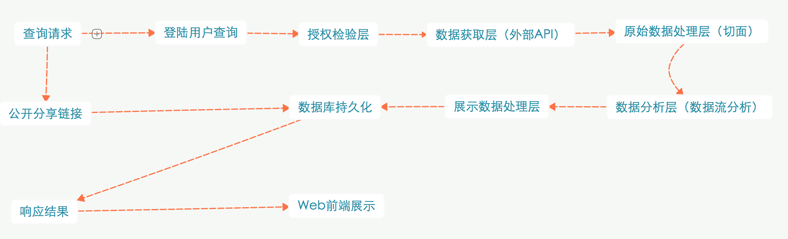

#基于个人社交平台的分析工具

##1.参考
1. 参考产品: [知微](http://www.weiboreach.com)
[数说传播](http://t.datastory.com.cn)
2. 参考项目 https://github.com/j0h4x0r/SentimentMiner
3. 外部API部分 官方文档：如[微博开放平台](http://open.weibo.com/wiki/首页)
4. 社交平台整合 https://github.com/belerweb/social-sdk
5. 爬虫部分 https://github.com/yuki-lau/weibo-spider
6. 数据分析框架 https://github.com/yahoo/samoa
7. 数据可视化部分 https://github.com/mbostock/d3

##2.主要功能架构
1. 数据来源：获取外部社交平台数据，这里主要以用户授权，通过官方或者第三方提供的API获取，不必用爬虫
2. 数据处理：对外部数据进行整合，适应平台内部数据格式
3. 数据持久化：对数据进行适当的持久化，定义数据库存储格式
4. 数据分析：对数据进行分析，包括但不限于：基于时间的数据分析，基于地理位置的数据分析，基于话题关键词的数据分析（较难），基于朋友关系的社交分析、基于性别的分析等
5. 数据持续获取：对于部分数据分析，如转发图，朋友关系图，可能需要持续的进行数据获取，这里可以通过API或者爬虫解决
6. 数据封装：对最终分析出的结果数据进行封装，交给Web表现层
7. Web表现层／数据可视化：对分析结果进行可视化，以Web为主，包括但不限于表格、折线图、无向图等

##3.主要难点
1. 数据持久化部分：如何定义高效的数据结构和数据库存储方式，以进行快速的分析（暂时定为不使用分布式系统）
2. 数据分析部分（较难）：对于比较复杂的数据分析（如话题关键词，朋友关系），如何进行数据分析，采用何种算法（比如Latent Dirichlet Allocation等）
3. 数据持续获取：如何进行高性能的持续获取以提供部分数据分析的需要，比如对转发链的处理，缓存如何加入，数据库如何设置等
4. 数据可视化：前端如何展示实现可视化数据

##4.需求分析
0. 基本页面：
	1. 主页：提供一个简易UI，两个按钮，登陆/注册；点击注册后，提供快速账号注册过程（邮箱为主），接着进行社交账号绑定页面（OAuth 2.0授权）；点击登陆后登陆邮箱密码，成功后跳转到查询页面
	2. 查询页面，上方Tab Bar包括修改密码，更新授权，等等功能（或者其他类似UI，待讨论），下方页面暂定为输入一个微博的URL，输完点击后然后后端分析，如果正常（既已经授权而且URL有效），则跳转到分析结果中页面。
	3. 授权页面，包括各社交平台授权状态，个人信息修改，密码修改等
	4. 分析结果中页面，提供一个用户等待页面
	5. 分析结果展示页面，提供各种分析结果的展示的页面，包括柱状图，饼状图，折线图等等。额外包括：分享按钮，产生分享URL，分享URL可直接访问查看分析结果，不需要登陆。

1. 微博转发层级图
对一条状态的转发者进行统计分析，绘制图形说明转发者之间的层级关系，以显著标志体现在转发过程中起到关键作用的用户。
具体说明：以转发者为节点，以转发关系（微博来源，微博转发去向）为连线，绘制一张无向图，对转发者加以权值，不同区域权值通过同心圆隔开

2. 微博情绪分析  
对每条评论的感情倾向做出判断。统计综合取值，以判断一条状态是否被受众正面接受。这涉及到了自然语言分析的部分，可以后期考虑。如果考虑实现的话可以有宽松的精度要求，若最终实现可以考虑作为宣传点。
具体说明：分析微博的正面情绪或者负面情绪，先以分词分出情绪词（如好，非常，开心，难受，等），再进行统计计算，需要自然语言处理部分，可参考开源
https://github.com/qibinlou/SinaWeibo-Emotion-Classification

3. 微博关键词分析  
为大概估计一次营销的成果，用户可以自己提供一个（或几个）关键词，然后系统根据这些关键词的出现频率评估用户的接受状况。
具体说明：对微博进行分词，并可根据转发历史找出关键词，对关键词进行分析，然后持久化。可提供非常简易的搜索（即直接以关键词为Key）

4. 微博地域分析  
以适当的图表对受众所在的大概地理位置进行呈现
具体说明：以省份为key，每个转发者加一个值，最终以一张地图或者图表展现

5. 受众的性别分析  
具体说明：统计转发或者评论者的性别，统计（分为男，女，其他），最终以饼状图呈现

6. 查看历史分析结果
具体说明：根据授权用户，授予每个人唯一ID，然后每次该用户的分析持久化（只需要持久化分析id），提供一个web展示

7. 分析结果分享
具体说明：授权用户可以分享该次分析，比如分享到朋友圈之类……（其实也就是一个URL，没难度……）

##5.流程架构设计

浏览器流程：

服务端流程

##6.API设计
[API设计文档](./api.md)

##7.数据格式定义
1. 内部原始数据格式
	1. 用户部分：  
用户id 性别 地理位置 兴趣（分类） 总转发数 总评论数 好友关系列表  
	2. 微博部分：  
微博id 微博来源（即上一层转发者id） 微博内容 微博发布日期 微博关键词（#) 微博被转发次数 微博被评论次数  
	3. 评论部分：（可选）  
用户id 微博id 评论内容
2. 内部持久化数据格式
3. 内部最终分析结果
	1. 时间线部分
	2. 性别分析部分
	3. 地理位置分析部分
	4. 关键词部分
	5. 转发层次图部分
	6. 情感分析部分

##8.数据库设计

1. 微博分析结果
微博作为 key
分析结果作为 value
